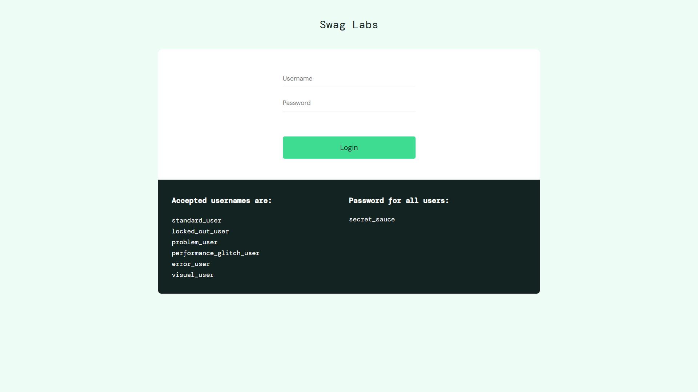
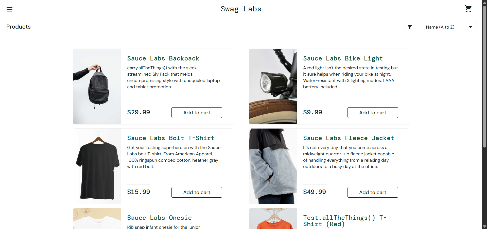
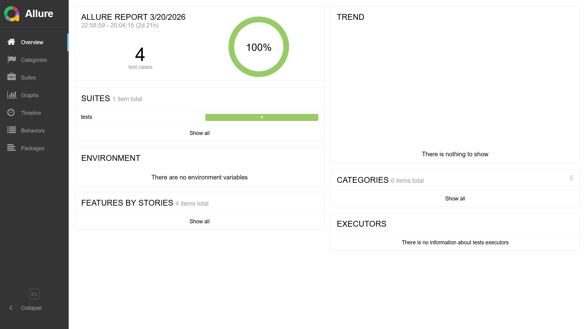
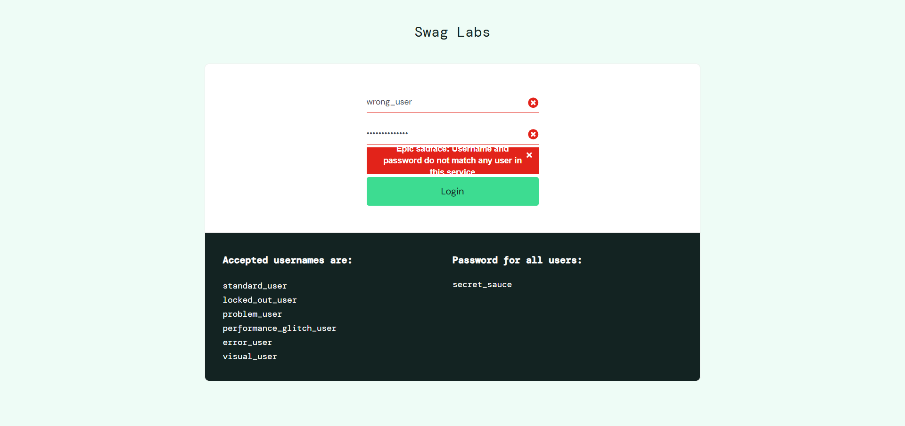

# 🚀 Selenium Python Automation Framework

<!-- 🔥 Preview Images for GitHub Cards -->

<!-- 

 -->

---

<p align="center">
  
</p>

A scalable **Web Automation Testing Framework** built using **Python, Selenium, and Pytest** implementing the **Page Object Model (POM)** design pattern.

This project demonstrates how automation frameworks are structured in real-world **QA Automation / SDET environments**.

---

## 📌 Project Overview

This framework automates test cases for a sample **E-commerce web application** and demonstrates industry-standard automation practices such as:

✔ Page Object Model (POM)
✔ Modular test structure
✔ Reusable automation utilities
✔ Clean and maintainable code

---

## 🧰 Tech Stack

| Tool               | Purpose                  |
| ------------------ | ------------------------ |
| Python             | Programming Language     |
| Selenium WebDriver | Web Automation           |
| Pytest             | Test Framework           |
| Page Object Model  | Framework Design Pattern |

---

## ✨ Key Features

✔ Automated **Login Test**
✔ **Add to Cart** test scenario
✔ Organized **Test Framework Structure**
✔ **Page Object Model (POM)** implementation
✔ Reusable **driver utilities**
✔ Screenshot capture on **test failure**
✔ Allure reporting integration
✔ Headless & parallel execution support

---

## 📸 Project Screenshots

### 🔐 Login Page

<p align="center">
  
</p>

---

### 🛒 Product Page (Add to Cart)

<p align="center">
  
</p>

---

### 📊 Allure Report

<p align="center">
  
</p>

---

### ❌ Failure Handling (Screenshot on Test Failure)

<p align="center">
  
</p>

---

## 📂 Project Structure

```
selenium-python-framework
│
├── pages          # Page Object classes
├── tests          # Test cases
├── utils          # Utility functions
├── reports        # Test reports
├── logs           # Execution logs
├── screenshots    # Screenshots (success & failure)
└── requirements.txt
```

---

## ⚙️ Installation

Clone the repository:

```
git clone https://github.com/yourusername/selenium-python-framework.git
```

Navigate to project folder:

```
cd selenium-python-framework
```

Install dependencies:

```
pip install -r requirements.txt
```

---

## ▶️ Running Tests

Run tests normally:

```
pytest -v
```

Run with Allure report:

```
pytest --alluredir=reports
allure serve reports
```

Run in headless mode:

```
pytest --headless
```

Run in parallel:

```
pytest -n auto
```

---

## 🎯 Future Improvements

✔ CI/CD integration (GitHub Actions)
✔ Cross-browser testing
✔ API automation integration
✔ Data-driven testing

---

## 👨‍💻 Author

**Ayush Gadag**
QA Automation Engineer | Selenium | Python | API Testing 🚀
